```{r setup, include=FALSE}
usethis::use_git_ignore(c("*.csv", "*.rds"))
options(htmltools.dir.version = FALSE)

library(knitr)
library(tidyverse)
library(xaringan)
library(fontawesome)
```

class: inverse, center, middle

# `r fa("fas fa-images", fill = "#fff")`

**View the slides:** 

[bretsw.com/sdl26-elden-ring](https://bretsw.com/sdl26-elden-ring/)


---

class: inverse, center, middle

# `r fa("far fa-compass", fill = "#fff")` <br><br> Introduction

---

# `r fa("far fa-compass", fill = "#fff")` Challenges Leading to SDL

```{r, out.width = "100%", echo = FALSE, fig.align = "center"}

```

---

# `r fa("far fa-compass", fill = "#fff")` Social Information Seeking

```{r, out.width = "720px", echo = FALSE, fig.align = "center"}

```

---

# `r fa("far fa-compass", fill = "#fff")` Challenges in Games

```{r, out.width = "100%", echo = FALSE, fig.align = "center"}
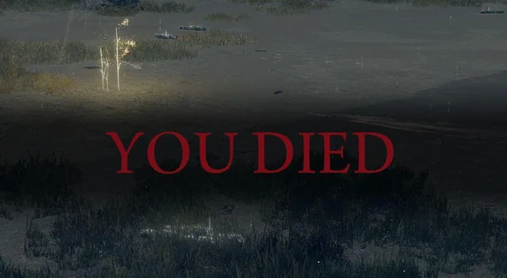
```

### A new level of challenges for players in the "Souls-like" genre

---

# `r fa("far fa-compass", fill = "#fff")` Challenges in Games

```{r, out.width = "100%", echo = FALSE, fig.align = "center"}
include_graphics("img/git-gud.png")
```

### Most common advice: "Git gud!"

---

# `r fa("far fa-compass", fill = "#fff")` Affinity Spaces

```{r, out.width = "640px", echo = FALSE, fig.align = "center"}
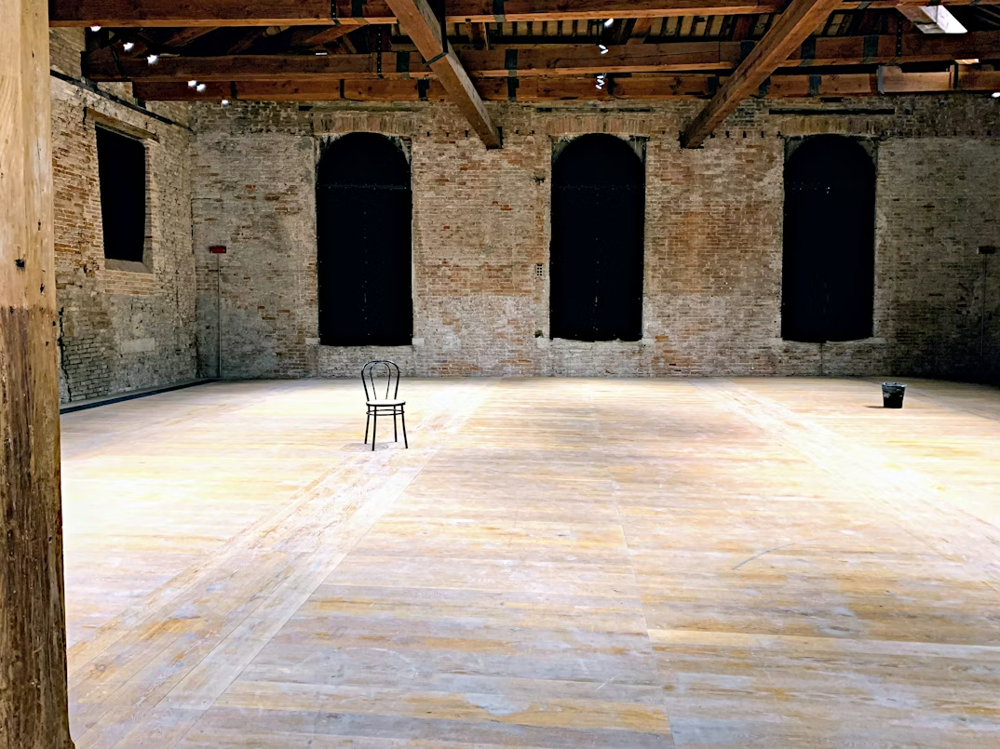
```

### Rooms-of-possibility: Users decide how to fill

---

# `r fa("far fa-compass", fill = "#fff")` r/Eldenring subreddit

```{r, out.width = "480px", echo = FALSE, fig.align = "center"}

```

### Affinity space for the Souls-like game *Elden Ring*

https://www.reddit.com/r/Eldenring/comments/1phgvbe/play_elden_ring_itll_be_fun/


---

class: inverse, center, middle

# `r fa("far fa-square", fill = "#fff")` <br><br> Framework: <br> Context-Aware Self-Teaching

---

# `r fa("far fa-square", fill = "#fff")` Context-Aware Self-Teaching

```{r, out.width = "600px", echo = FALSE, fig.align = "center"}
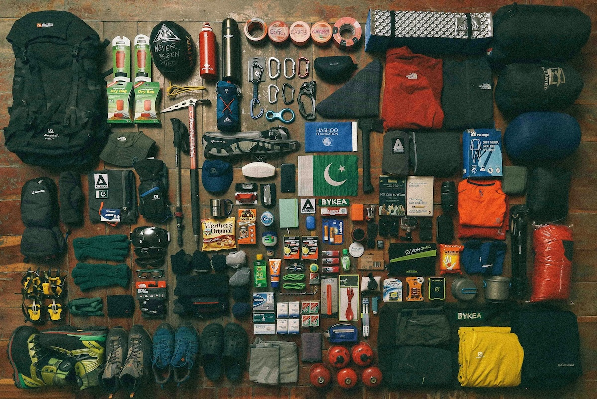
```

--

### Start (*Self-Motivation*)

--

1. `r fa("fas fa-map-pin", fill = "#782F40")` Performance Objective

--

2. `r fa("fas fa-house-user", fill = "#782F40")` Starting Context

---

# `r fa("far fa-square", fill = "#fff")` Context-Aware Self-Teaching

```{r, out.width = "600px", echo = FALSE, fig.align = "center"}

```

### Practice (*Self-Management*)

--

3. `r fa("fas fa-person-walking", fill = "#782F40")` Exploration and Practice

--

4. `r fa("fas fa-gauge-high", fill = "#782F40")` Maintenance of Difficulty Level

---

# `r fa("far fa-square", fill = "#fff")` Context-Aware Self-Teaching

```{r, out.width = "600px", echo = FALSE, fig.align = "center"}

```

### Assess (*Self-Monitoring*)

--

5. `r fa("fas fa-people-arrows", fill = "#782F40")` Supplementing with External Guides

--

6. `r fa("fas fa-ruler-combined", fill = "#782F40")` Evaluation


---

class: inverse, center, middle

# `r fa("fas fa-list", fill = "#fff")` <br><br> Method 

---

# `r fa("fas fa-list", fill = "#fff")` Method: Data Mining

```{r, out.width = "640px", echo = FALSE, fig.align = "center"}
include_graphics("img/data-mining.jpg")
```

### r/Eldenring subreddit

--

**993 posts, October 9-16, 2025**


---

class: inverse, center, middle

# `r fa("fas fa-cubes-stacked", fill = "#fff")` <br><br> Results

---

class: inverse, center, middle

# `r fa("fas fa-cubes-stacked", fill = "#fff")` <br><br> Results: RQ1 <br>

To what extent, if any, does the integration of user-defined metadata improve the automated classification of SDL?

---

# `r fa("fas fa-cubes-stacked", fill = "#fff")` Results: RQ1

```{r, out.width = "360px", echo = FALSE, fig.align = "center"}
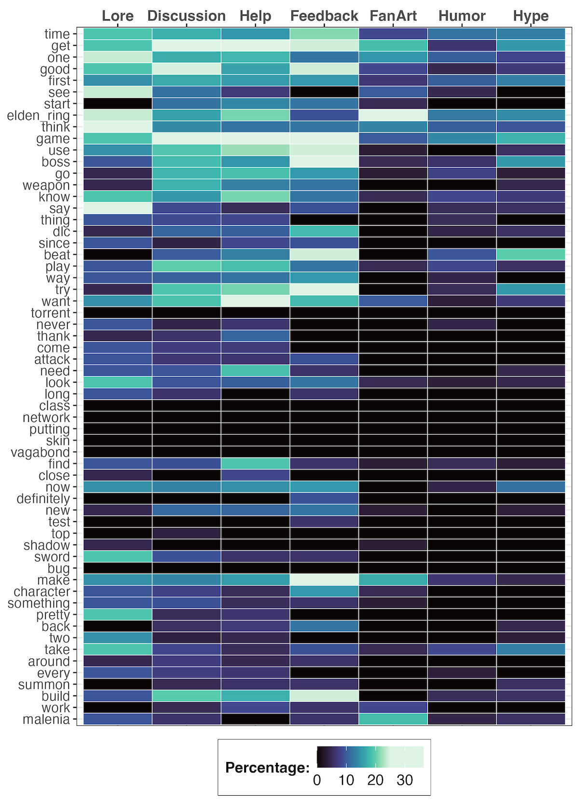
```

**Figure 1.** Top Terms Included in r/Eldenring by Post Flair

---

# `r fa("fas fa-cubes-stacked", fill = "#fff")` Results: RQ1

```{r, out.width = "640px", echo = FALSE, fig.align = "center"}
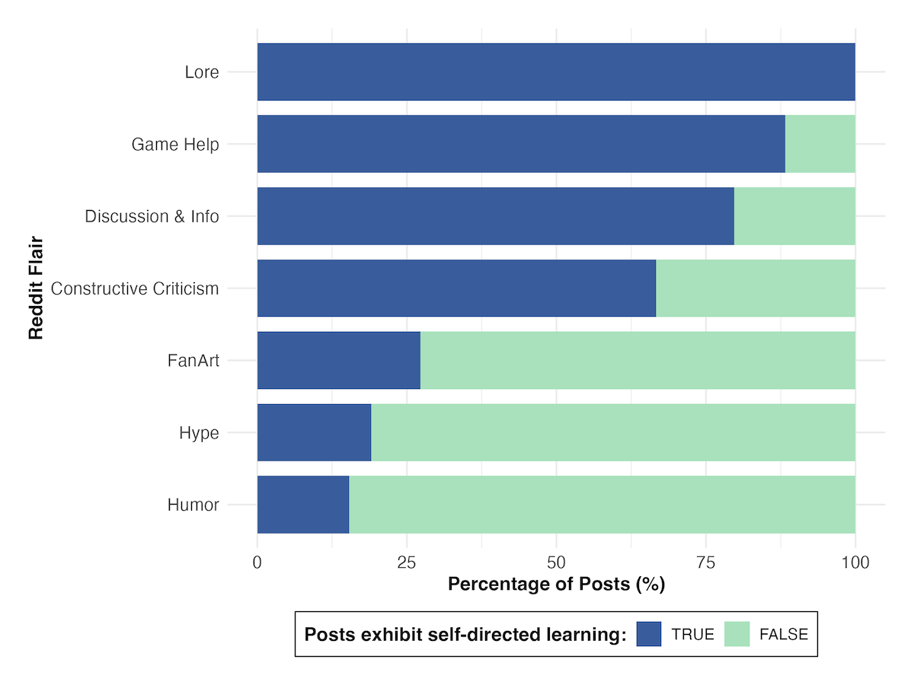
```

**Figure 2.** Prevalence of Self-Directed Learning by User Flair

---

# `r fa("fas fa-cubes-stacked", fill = "#fff")` Results: RQ1

```{r, out.width = "480px", echo = FALSE, fig.align = "center"}
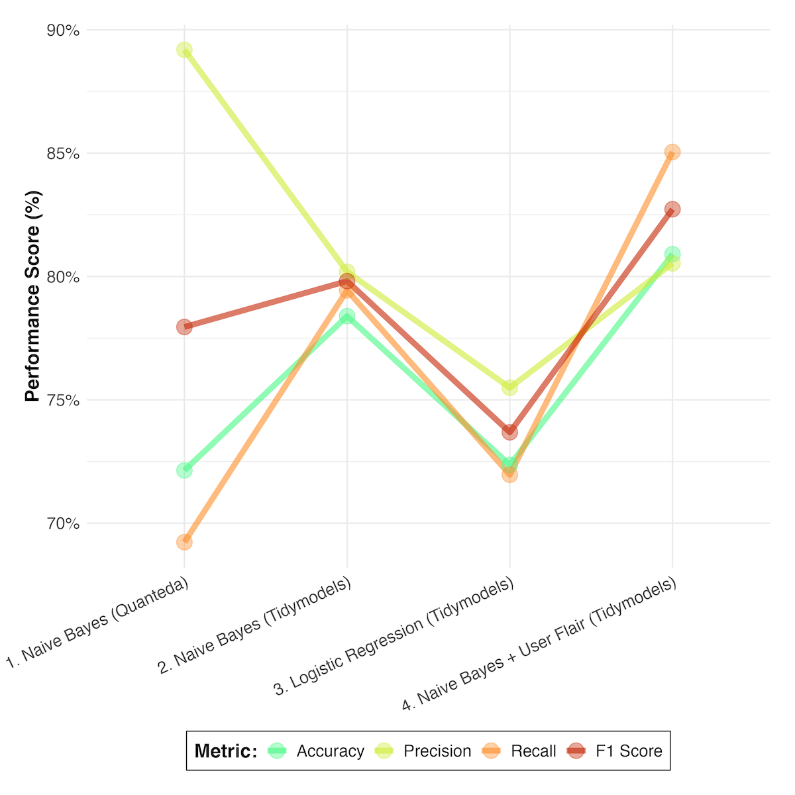
```

**Figure 3.** Progression of Machine-Learning Classifier Model Efficacy


---

class: inverse, center, middle

# `r fa("fas fa-cubes-stacked", fill = "#fff")` <br><br> Results: RQ2 <br> 

How is SDL distributed across different community-defined discourse categories?

---

# `r fa("fas fa-cubes-stacked", fill = "#fff")` Results: RQ2

```{r, out.width = "640px", echo = FALSE, fig.align = "center"}

```

**Figure 2.** Prevalence of Self-Directed Learning by User Flair


---

class: inverse, center, middle

# `r fa("fas fa-cubes-stacked", fill = "#fff")` <br><br> Results: RQ3 <br> 

What conceptual subdomains are evident in SDL discourse?

---

# `r fa("fas fa-cubes-stacked", fill = "#fff")` Results: RQ3

```{r, out.width = "640px", echo = FALSE, fig.align = "center"}
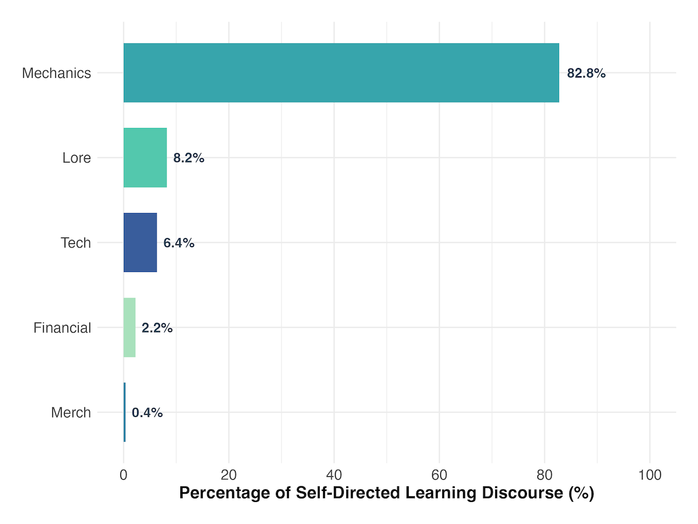
```

**Figure 4.** Distribution of Conceptual Subdomains within Self-Directed Learning Discourse


---

class: inverse, center, middle

# `r fa("fas fa-cubes-stacked", fill = "#fff")` <br><br> Results: RQ4 <br>

To what extent, if any, does SDL discourse occur in r/EldenRing?

---

# `r fa("fas fa-cubes-stacked", fill = "#fff")` Results: RQ4

```{r, out.width = "480px", echo = FALSE, fig.align = "center"}
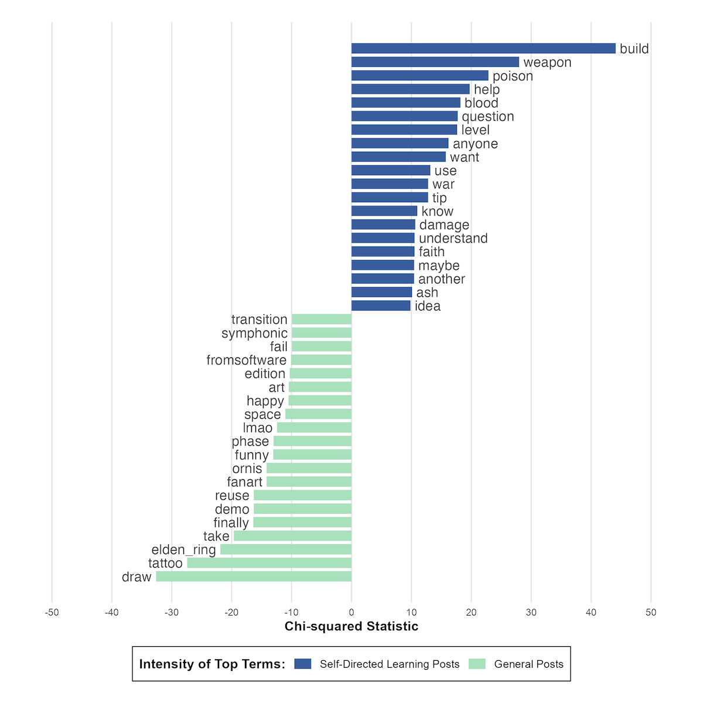
```

**Figure 5.** Intensity of Top Terms Used in r/Eldenring Posts with Exhibiting Self-Directed Learning vs. Not

---

# `r fa("fas fa-cubes-stacked", fill = "#fff")` Results: RQ4

```{r, out.width = "480px", echo = FALSE, fig.align = "center"}
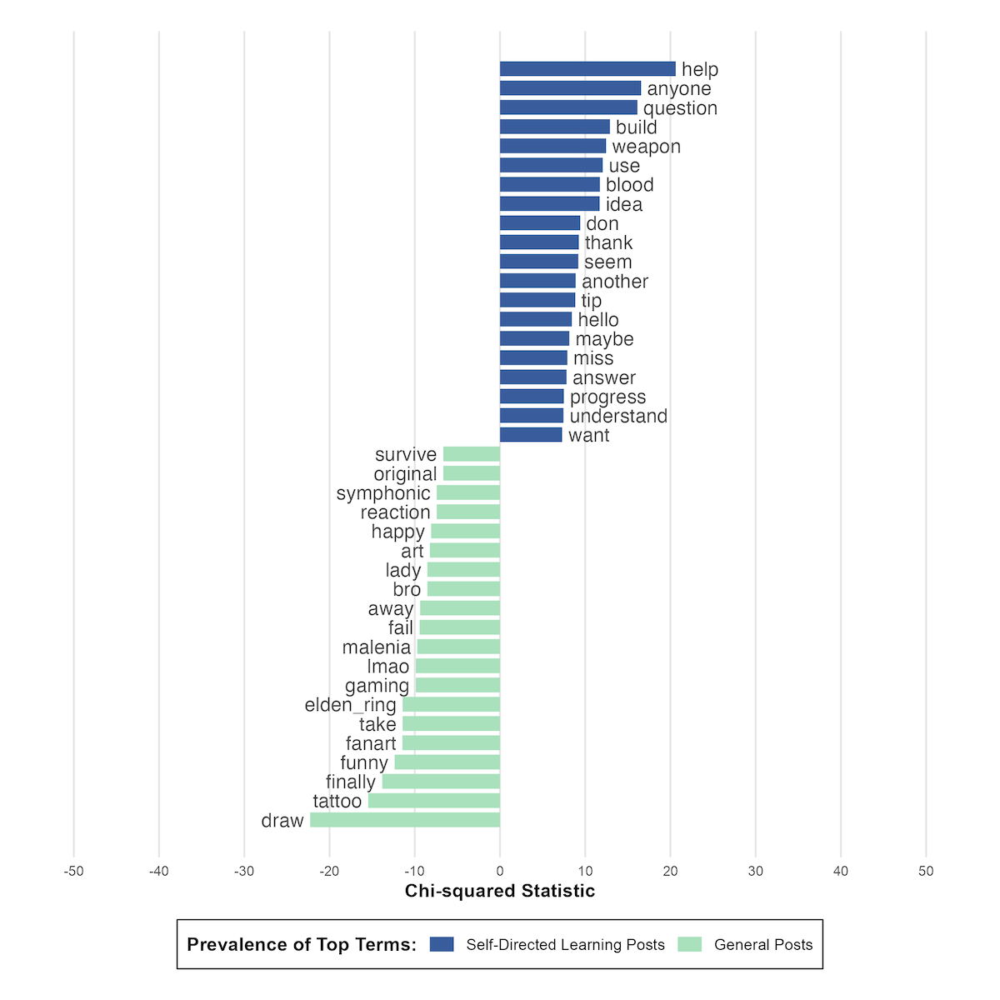
```

**Figure 6.** Prevalence of Top Terms Used in r/Eldenring Posts with Exhibiting Self-Directed Learning vs. Not

---

# `r fa("fas fa-cubes-stacked", fill = "#fff")` Results: RQ4

```{r, out.width = "480px", echo = FALSE, fig.align = "center"}
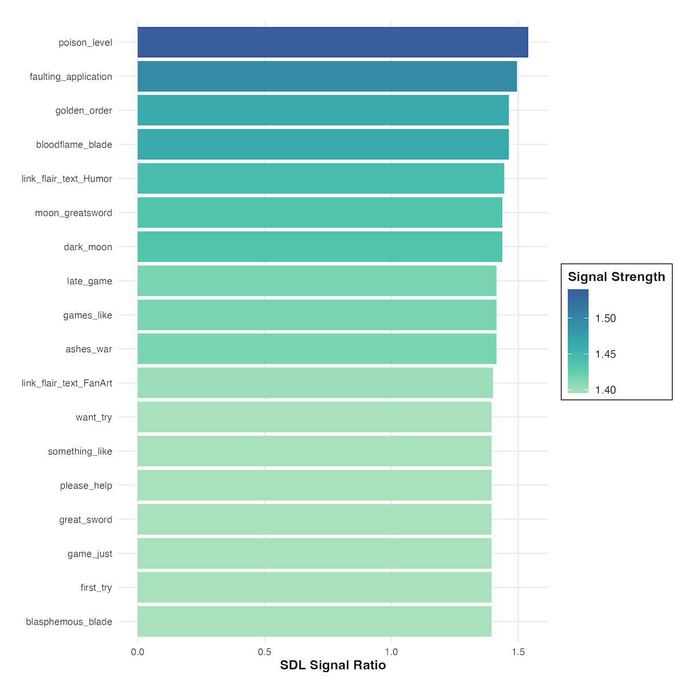
```

**Figure 7.** Top 15 Linguistic Bigram Predictors of Self-Directed Learning


---

class: inverse, center, middle

# `r fa("fas fa-map-pin", fill = "#fff")` <br><br> Implications

---

# `r fa("fas fa-map-pin", fill = "#fff")` Implications

```{r, out.width = "720px", echo = FALSE, fig.align = "center"}

```

### *Feedback loops* make challenges manageable

---

# `r fa("fas fa-map-pin", fill = "#fff")` Implications

```{r, out.width = "720px", echo = FALSE, fig.align = "center"}

```

### *Tagging* serves as a metacognitive anchor

---

# `r fa("fas fa-map-pin", fill = "#fff")` Implications

```{r, out.width = "720px", echo = FALSE, fig.align = "center"}
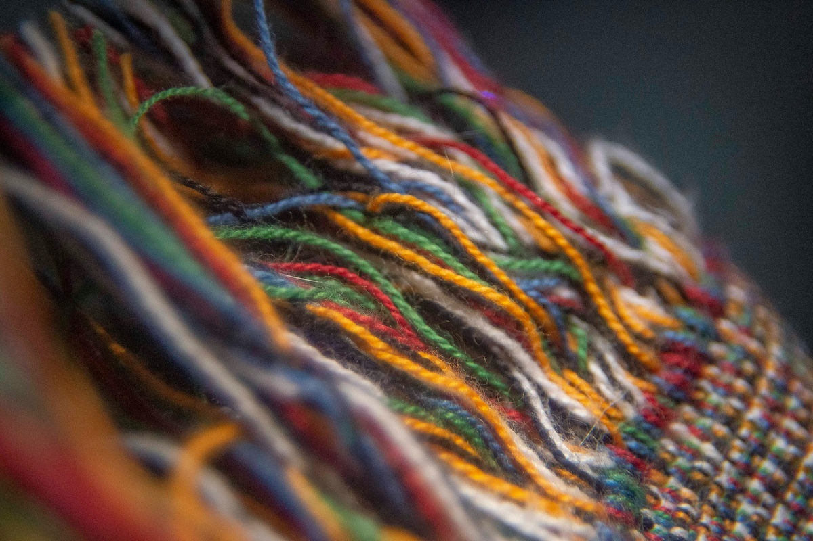
```

### *Threads* reinforce that learning is a social byproduct

---

# `r fa("fas fa-map-pin", fill = "#fff")` Implications

```{r, out.width = "640px", echo = FALSE, fig.align = "center"}

```

### *Linguistic scaffolding* provides path for specialized vocabulary


---

class: inverse, center, middle

# `r fa("fas fa-arrows-left-right-to-line", fill = "#fff")` <br><br> Future Research

---

# `r fa("fas fa-arrows-left-right-to-line", fill = "#fff")` Future Research

```{r, out.width = "600px", echo = FALSE, fig.align = "center"}

```

--

- SDL in other subreddits and other affinity spaces

--

- SDL by quiet observers (lurkers)

--

- Predictive bigrams to suggest tags/flair


---

class: inverse, center, middle

# `r fa("fas fa-compass", fill = "#fff")` <br><br> Conclusion

---

# `r fa("far fa-compass", fill = "#fff")` Conclusion

```{r, out.width = "640px", echo = FALSE, fig.align = "center"}

```

### Start + Practice + Assess

**Viable machine learning approach to identifying SDL**


---

class: inverse, center, middle

# `r fa("fas fa-question", fill = "#fff")` <br><br> Questions

**What would you like to know more about?**

<hr>

<br><br><br><br>

**Bret Staudt Willet | Jackson Anderson | Wes Dorce** <br><br> Florida State University

`r fa("envelope", fill = "#fff")` [bret.staudtwillet@fsu.edu](mailto:bret.staudtwillet@fsu.edu) | `r fa("globe", fill = "#fff")` [bretsw.com](https://bretsw.com/) | `r fa("fab fa-github", fill = "#fff")` [GitHub](https://github.com/bretsw/)